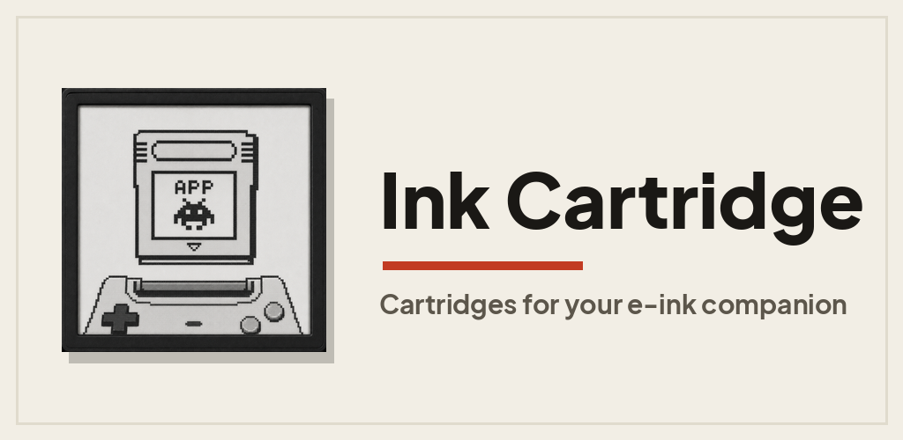
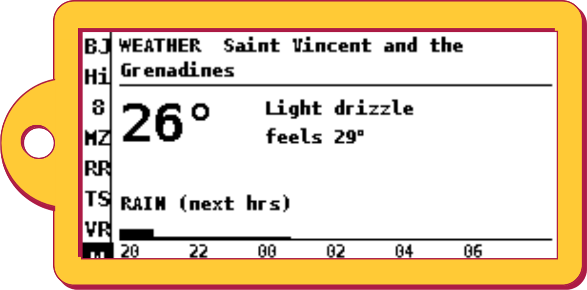
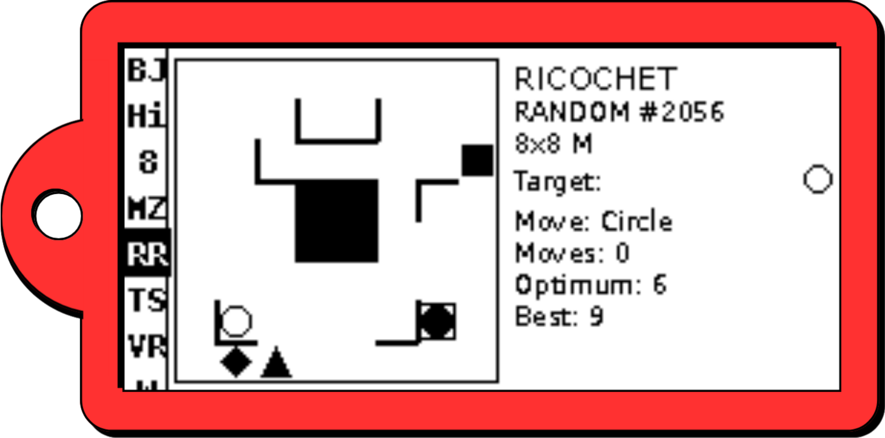
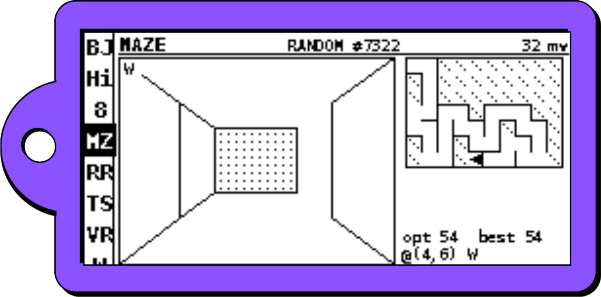

<div align="center">

# 🖋️ Ink Cartridges

### Turn your pwnagotchi's screen into an app you actually use.

**A one-tap app store for your pwnagotchi's e-ink display.** Games, a weather
glance, a tide & sun clock — and a catalog that keeps growing. Installed from
your phone over Bluetooth, while pwnagotchi keeps hunting underneath.

[](LICENSE)
[](pwnagotchi-plugin/LICENSE)
[](#the-catalog)
[](https://pwnagotchi.org)

<br>



<br>
<br>





<sub>Just a few examples from a growing catalog — a weather glance, Ricochet Robots, and a first-person maze.</sub>

</div>

---

## What is this?

Your pwnagotchi has a little e-ink screen that normally just shows its face and
some stats. **Ink Cartridges lets you put something else on it** — a game, a
clock, a weather panel — and switch between them from your phone, in one tap.

The catch with pwnagotchi screens has always been: adding anything new meant
SSHing in and editing plugins by hand. Ink Cartridges fixes that. You install
**one** host plugin once; after that, everything is browse-and-install from the
companion app, over Bluetooth. No cables, no SSH, no fighting `config.toml`.

And crucially: **your pwnagotchi never stops being a pwnagotchi.** A cartridge
only borrows the screen. The Wi-Fi radio keeps hunting handshakes the whole
time, and "Deactivate" snaps you back to the normal face instantly.

This repo is the **public catalog** the app reads. Every cartridge here is
maintainer-reviewed before it ships.

## The catalog

What's installable **today** — the catalog is constantly expanding, with new
cartridges landing over time. These are just examples, not the whole story.

| Cartridge | What it does | |
|---|---|---|
| 🎲 **Blackjack** | Blackjack 21 — buttons on the phone, cards on the e-ink. | Games |
| 🎰 **Magic 8-Ball** | Ask a question, tap Shake, get your answer. | Entertainment |
| 🧭 **Maze** | First-person maze crawler — random or a shared daily seed. | Games |
| 🤖 **Ricochet Robots** | Slide a robot till it crashes a wall; reach the target in the fewest moves. | Games |
| 🏁 **Vector Racing** | Turn-based vector racing on a circuit, with a 9-way pad on your phone. | Games |
| 🌤️ **Weather** | Current conditions + an hourly precipitation forecast. | Weather |
| 🌊 **Tide & Sun** | Sunrise/sunset, moon phase, and a cached next-tides graph. | Weather |
| 👋 **Hello** | Minimal demo — push text from the app, watch it appear. A template for builders. | Utilities |

New cartridges land here regularly. Want one that isn't here yet?
[Build your own](#build-a-cartridge) — contributions are welcome.

---

## Connect your device

> **You just flashed pwnagotchi onto a Raspberry Pi? Start here.** This is a
> **one-time** setup. After it, you'll never need a terminal again — new
> cartridges install straight from the app.

You need three things: a running pwnagotchi, the companion app on your phone, and
five minutes.

### 1. Put the host plugin on your pwnagotchi

The host plugin is what hosts every cartridge and talks to the app. It's a
single, readable Python file you copy onto the device **once**.

**Download it:** [`pwnagotchi-plugin/ink-cartridge.py`](pwnagotchi-plugin/ink-cartridge.py)
(click *Download raw file* on GitHub), or grab it on the device directly.

**Reach your device.** pwnagotchi shows up over SSH. The two easy ways in:

- **USB cable** → it's at `10.0.0.2`, log in as `pi`:
  `ssh pi@10.0.0.2`
- **Same network** → use its name (the pet name you gave it when flashing):
  `ssh pi@pwnagotchi.local` *(replace `pwnagotchi` with your device's name)*

> This is exactly how we set it up while building the catalog — SSH in over the
> USB link using the device's own name, drop the file in, restart. Nothing fancier.

**Install it.** Copy the plugin in, enable it, restart pwnagotchi:

```sh
# From your computer (run the download step's file path or cd to this repo first):
scp pwnagotchi-plugin/ink-cartridge.py pi@pwnagotchi.local:/tmp/

ssh pi@pwnagotchi.local '
  sudo mv /tmp/ink-cartridge.py /usr/local/share/pwnagotchi/custom-plugins/ &&
  printf "\n[main.plugins.ink-cartridge]\nenabled = true\n" | sudo tee -a /etc/pwnagotchi/config.toml &&
  sudo systemctl restart pwnagotchi
'
```

Give it ~15 seconds to restart. That's the whole device side.

<details>
<summary><b>Prefer to do it by hand?</b> (or the one-liner failed)</summary>

1. Copy `ink-cartridge.py` into `/usr/local/share/pwnagotchi/custom-plugins/`.
2. Add this to the end of `/etc/pwnagotchi/config.toml`:
   ```toml
   [main.plugins.ink-cartridge]
   enabled = true
   ```
3. Restart: `sudo systemctl restart pwnagotchi`.
4. Need it? The Bluetooth link uses BlueZ via `python3-dbus` + `python3-gi`.
   Recent images include them; if the log shows a dbus/gi import error, run
   `sudo apt install python3-dbus python3-gi` and restart again.

See [`pwnagotchi-plugin/README.md`](pwnagotchi-plugin/README.md) for every config
option and how to audit the file before trusting it.
</details>

### 2. Connect the app over Bluetooth

The companion app talks to your pwnagotchi over a **private Bluetooth link**
(BLE on iOS, Bluetooth Classic on Android). It's local and lightweight, and it
**never touches the Pi's Wi-Fi radio**, so your pwnagotchi keeps hunting the
entire time you're in the app. How you connect depends on your phone:

- **iOS / iPadOS** — *automatic.* Just open the app. It finds your pwnagotchi and
  connects on its own: no pairing code, nothing to set up in iOS Bluetooth
  settings.
- **Android** — *pair once first.* In the phone's **Bluetooth settings**, pair
  your pwnagotchi (Bluetooth Classic needs it). Then open the app, go to
  **Settings → choose your device**, and tap **Connect**. After that it
  reconnects on its own.

### 3. Browse and install

Open the **Apps** tab → **Switch app** → and you're looking at this catalog. Tap
**Install** on anything. It downloads to the device over Bluetooth and shows up
on the e-ink on **Activate**. Tap **Stop** to hand the screen back to pwnagotchi.

That's it. From now on, the whole catalog is one tap away — no terminal in sight.

---

## Get the app

The Ink Cartridge companion app is the front-end for this catalog.

Both apps are **currently in review** in their respective stores. Download links
are TBD and will be added here as soon as they're approved.

<!-- Update with real store badges/links once each listing goes live. -->
- **Android (Google Play)** — *in review — link coming once approved*
- **iOS / iPadOS (App Store)** — *in review — link coming once approved*

The app is closed-source for now; the catalog and the host plugin in this repo
are open.

---

## Build a cartridge

A cartridge is a tiny package: one Python file that draws on the e-ink, plus a
manifest describing it. The app renders each cartridge's phone-side controls
**from data** (a `ui.json`), so most cartridges need no app code at all.

A folder under [`apps/`](apps/) looks like:

```
apps/<name>/
├── <stem>.py             # the cartridge: a class with name, icon, render()
├── <stem>.manifest.json  # name, icon, version, author, description, category…
├── <stem>.ui.json        # optional: the phone-side buttons/widgets
└── icon.png              # optional
```

The **manifest is the single source of truth** — `index.json` is *generated*
from the manifests, never hand-edited.

**To add one:**

1. Copy an existing folder under `apps/` as a template (start from
   [`apps/hello`](apps/hello) — it's the minimal example).
2. Fill in your `.py` + `.manifest.json` (+ optional `.ui.json`).
3. Regenerate the index and open a PR:
   ```sh
   python3 build_index.py      # rebuilds index.json from the manifests
   ```

CI runs `build_index.py --check` and fails the PR if `index.json` is stale, so
don't forget step 3. v1 is maintainer-curated — PRs are welcome and reviewed.

**Full guides:**
- [`CONTRIBUTING.md`](CONTRIBUTING.md) — the step-by-step + conventions.
- [`docs/ink-cartridge-ui-schema.md`](docs/ink-cartridge-ui-schema.md) — the
  cartridge contract: manifest fields, the `ui.json` widget vocabulary, actions,
  `data_source`, secrets, `published_state()`.
- [`docs/ink-cartridge-catalog-schema.md`](docs/ink-cartridge-catalog-schema.md)
  — the index/catalog contract.

## How it works

```
┌─────────────┐   Bluetooth    ┌──────────────────────────────┐   reads    ┌──────────────┐
│ Companion   │  (RFCOMM/BLE)  │  pwnagotchi                  │  index.json │  this repo   │
│ app (phone) │ ─────────────► │  └─ ink-cartridge host plugin│ ◄────────── │  (the catalog)│
└─────────────┘                │     └─ runs one cartridge    │             └──────────────┘
                               │        on the e-ink          │
                               │  ── keeps hunting Wi-Fi ──    │
                               └──────────────────────────────┘
```

- **This repo** publishes `index.json` + the cartridge files. The app fetches the
  index on Browse and downloads what you install.
- **The host plugin** ([`pwnagotchi-plugin/`](pwnagotchi-plugin/)) runs on the
  device, hosts the active cartridge, and serves the Bluetooth link. Open-source,
  GPLv3.
- **The app** is the remote: browse, install, activate, and send input (a card
  tap, a maze step) to the cartridge.

## Privacy & safety

- A cartridge only borrows the **screen**. pwnagotchi keeps doing its thing.
- The app↔device link is a **local Bluetooth** connection to a device you own —
  no cloud, no account.
- Some cartridges (Weather, Tide & Sun) use your location to fetch a forecast;
  that's opt-in and handled by the app. App secrets (API keys) are stored
  encrypted on the phone.
- Full details: [`PRIVACY.md`](PRIVACY.md).

## Licensing

This repo is **dual-licensed**, by scope:

- **The catalog** — cartridges, manifests, `index.json`, `build_index.py`, docs —
  is **[MIT](LICENSE)**. Permissive: build on it freely.
- **The host plugin** in [`pwnagotchi-plugin/`](pwnagotchi-plugin/) is
  **[GPLv3](pwnagotchi-plugin/LICENSE)**, because it links pwnagotchi (itself
  GPLv3).

The companion app is proprietary and not part of this repository.

---

<div align="center">
<sub>Not affiliated with the pwnagotchi project. "pwnagotchi" belongs to its authors.</sub>
</div>
